[](https://central.sonatype.com/artifact/io.github.mflisar.composedebugdrawer/core)   
# ComposeDebugDrawer
     

This library provides following main features:

* easily extendible
* one line integration
* can be easily enabled/diabled in debug/release builds or based on a user setting
* predefined optional modules

# Table of Contents

- [Screenshots](#camera-screenshots)
- [Supported Platforms](#computer-supported-platforms)
- [Versions](#arrow_right-versions)
- [Setup](#wrench-setup)
- [Usage](#rocket-usage)
- [Modules](#file_folder-modules)
- [Demo](#sparkles-demo)
- [More](#information_source-more)
- [API](#books-api)
- [Other Libraries](#bulb-other-libraries)

# :camera: Screenshots

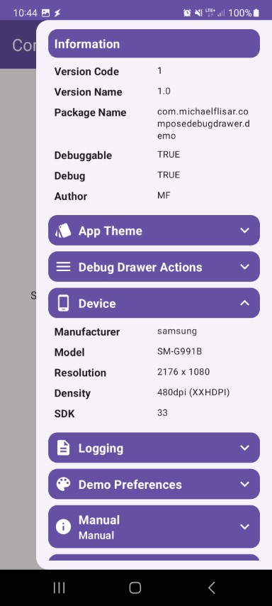
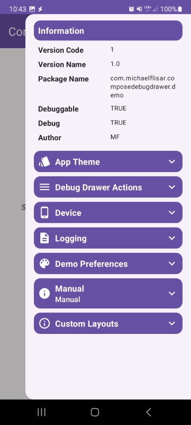
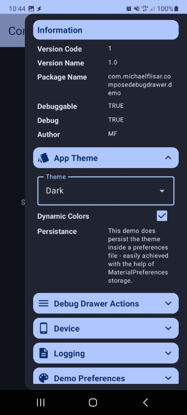
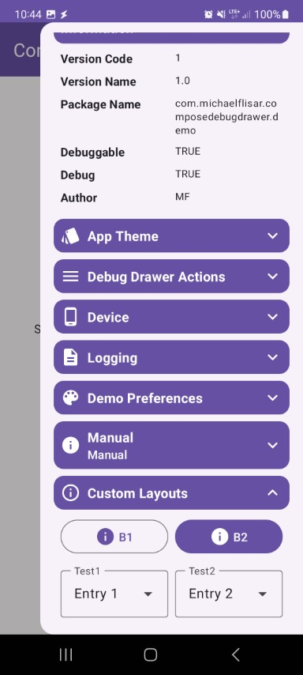
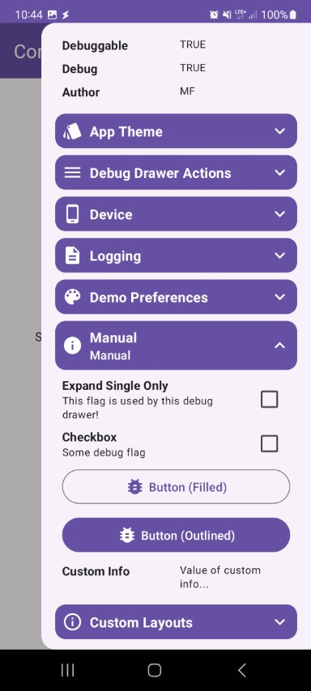
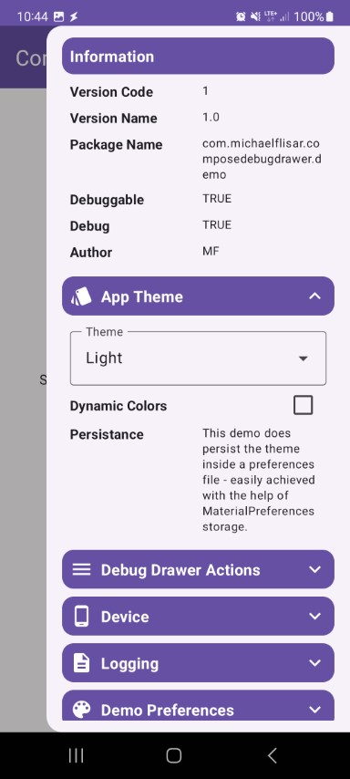
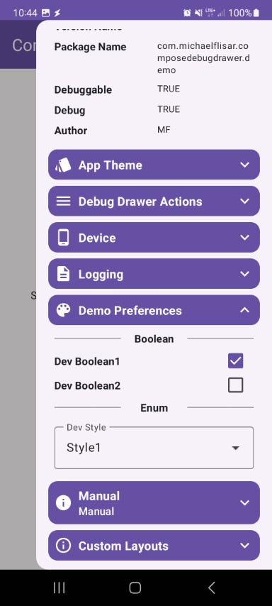
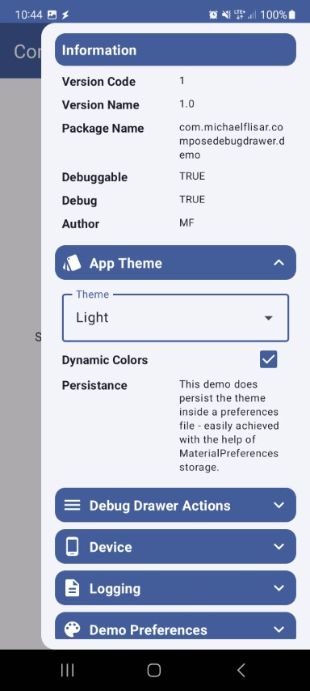
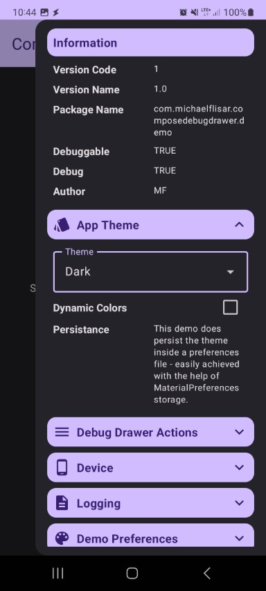
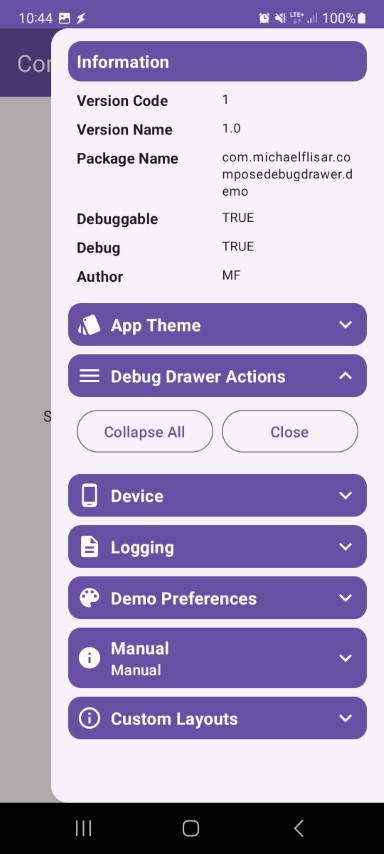
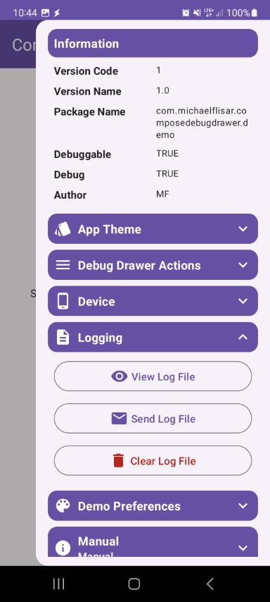

# :computer: Supported Platforms

| Module | android | iOS | windows | macOS | wasm |
|---|---|---|---|---|---|
| core | ✅ | ✅ | ✅ | ✅ | ✅ |
| infos-build | ✅ | ❌ | ❌ | ❌ | ❌ |
| infos-device | ✅ | ❌ | ❌ | ❌ | ❌ |
| plugin-kotpreferences | ✅ | ✅ | ✅ | ✅ | ✅ |
| plugin-lumberjack | ✅ | ✅ | ✅ | ✅ | ❌ |

# :arrow_right: Versions

| Dependency | Version |
|---|---|
| Kotlin | `2.3.20` |
| Jetbrains Compose | `1.10.3` |
| Jetbrains Compose Material3 | `1.9.0` |

> :warning: Following experimental annotations are used:
> - **OptIn**
>   - `androidx.compose.material3.ExperimentalMaterial3Api` (1x)
>   - `androidx.compose.ui.ExperimentalComposeUiApi` (1x)
>
> I try to use as less experimental features as possible, but in this case the ones above are needed!

# :wrench: Setup

<details open>

<summary><b>Using Version Catalogs</b></summary>

<br>

Define the dependencies inside your **libs.versions.toml** file.

```toml
[versions]

composedebugdrawer = "<LATEST-VERSION>"

[libraries]

composedebugdrawer-core = { module = "io.github.mflisar.composedebugdrawer:core", version.ref = "composedebugdrawer" }
composedebugdrawer-infos-build = { module = "io.github.mflisar.composedebugdrawer:infos-build", version.ref = "composedebugdrawer" }
composedebugdrawer-infos-device = { module = "io.github.mflisar.composedebugdrawer:infos-device", version.ref = "composedebugdrawer" }
composedebugdrawer-plugin-kotpreferences = { module = "io.github.mflisar.composedebugdrawer:plugin-kotpreferences", version.ref = "composedebugdrawer" }
composedebugdrawer-plugin-lumberjack = { module = "io.github.mflisar.composedebugdrawer:plugin-lumberjack", version.ref = "composedebugdrawer" }
```

And then use the definitions in your projects **build.gradle.kts** file like following:

```java
implementation(libs.composedebugdrawer.core)
implementation(libs.composedebugdrawer.infos.build)
implementation(libs.composedebugdrawer.infos.device)
implementation(libs.composedebugdrawer.plugin.kotpreferences)
implementation(libs.composedebugdrawer.plugin.lumberjack)
```

</details>

<details>

<summary><b>Direct Dependency Notation</b></summary>

<br>

Simply add the dependencies inside your **build.gradle.kts** file.

```kotlin
val composedebugdrawer = "<LATEST-VERSION>"

implementation("io.github.mflisar.composedebugdrawer:core:${composedebugdrawer}")
implementation("io.github.mflisar.composedebugdrawer:infos-build:${composedebugdrawer}")
implementation("io.github.mflisar.composedebugdrawer:infos-device:${composedebugdrawer}")
implementation("io.github.mflisar.composedebugdrawer:plugin-kotpreferences:${composedebugdrawer}")
implementation("io.github.mflisar.composedebugdrawer:plugin-lumberjack:${composedebugdrawer}")
```

</details>

# :rocket: Usage

#### Debug Drawer

```kotlin
// wrap your app content inside the drawer like following
val drawerState = rememberDebugDrawerState()
ComposeAppTheme  {
    DebugDrawer(
        enabled = BuildConfig.DEBUG, // if disabled the drawer will not be created at all, in this case inside a release build...
        drawerState = drawerState,
        drawerContent = {
            // drawer content
        },
        content = {
            // your wrapped app content
        }
    )
}
```

#### Example Drawer Content

```kotlin
@Composable
private fun Drawer(drawerState: DebugDrawerState) {
    DebugDrawerBuildInfos(drawerState)
    DebugDrawerActions(drawerState)
    DebugDrawerDeviceInfos(drawerState)

    // lumberjack module for logs
    DebugDrawerLumberjack(
        drawerState = drawerState,
        setup = DemoLogging.fileLoggingSetup,
        mailReceiver = "feedback@gmail.com"
    )

    // kotpreferences module for delegate based preferences (another library of mine)
    DebugDrawerRegion(
        image = { Icon(Icons.Default.ColorLens, null) },
        label = "Demo Preferences",
        drawerState = drawerState
    ) {
        DebugDrawerDivider(info = "Boolean")
        DebugDrawerSettingCheckbox(setting = DemoPrefs.devBoolean1)
        DebugDrawerSettingCheckbox(setting = DemoPrefs.devBoolean2)
        DebugDrawerDivider(info = "Enum")
        DebugDrawerSettingDropdown(setting = DemoPrefs.devStyle,items = DemoPrefs.UIStyle.values())
    }

    // manual checkboxes, dropdowns, infos
    DebugDrawerRegion(
        image = { Icon(Icons.Default.Info, null) },
        label = "Manual",
        drawerState = drawerState
    ) {
        // Checkbox
        var test1 by remember { mutableStateOf(false) }
        DebugDrawerCheckbox(
            label = "Checkbox",
            description = "Some debug flag",
            checked = test1
        ) {
            test1 = it
        }

        // Button
        DebugDrawerButton(
            image = { Icon(Icons.Default.BugReport, null) },
            label = "Button (Filled)"
        ) {
            // on click
        }

        // Dropdown
        val items = listOf("Entry 1", "Entry 2", "Entry 3")
        var selected by remember { mutableStateOf(items[0]) }
        DebugDrawerDropdown(
            modifier = modifier,
            label = "Items",
            selected = selected,
            items = items
        ) {
            selected = it
        }

        // Sectioned Button
        val items2 = listOf("L1", "L2", "L3")
        val level = remember { mutableStateOf(items2[0]) }
        DebugDrawerSegmentedButtons(
            selected = level, 
            items = items2
        )

        // Info
        DebugDrawerInfo(title = "Custom Info", info = "Value of custom info...")
    }
}
```

# :file_folder: Modules

- [Build Infos](documentation/Modules/Build%20Infos.md)
- [Device Infos](documentation/Modules/Device%20Infos.md)

# :sparkles: Demo

A full [demo](/demo) is included inside the demo module, it shows nearly every usage with working examples.

# :information_source: More

- Migration
  - [v0.7.1](documentation/Migration/v0.7.1.md)
- Plugins
  - [KotPreferences](documentation/Plugins/KotPreferences.md)
  - [Lumberjack](documentation/Plugins/Lumberjack.md)

# :books: API

Check out the [API documentation](https://MFlisar.github.io/ComposeDebugDrawer/).

# :bulb: Other Libraries

You can find more libraries (all multiplatform) of mine that all do work together nicely [here](https://mflisar.github.io/Libraries/).
