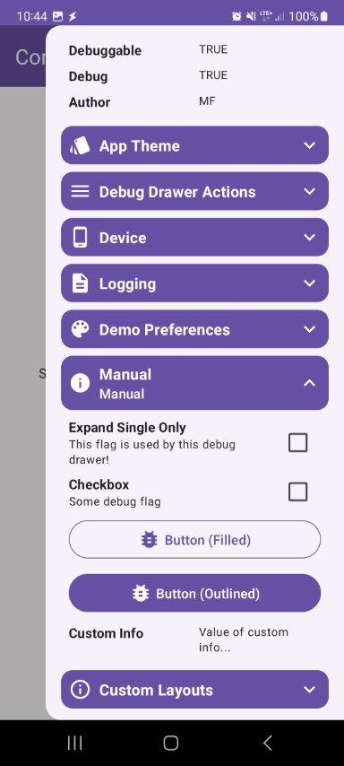

### About

[](https://central.sonatype.com/namespace/io.github.mflisar.composedebugdrawer)
[](https://android-arsenal.com/api?level=21)
[](https://kotlinlang.org/)
[](https://kotlinlang.org/docs/multiplatform.html)
[](LICENSE)

<h1 align="center">ComposeDebugDrawer</h1>

This library offers you a **simple** and easily readme **debug drawer**.

## :heavy_check_mark: Features

* easily extendible
* one line integration
* can be easily enabled/diabled in debug/release builds or based on a user setting
* predefined optional modules

**All features are splitted into separate modules, just include the modules you want to use!**

## :camera: Screenshots

| Demos | | | |
|-|-|-|-|
|  |  |  |  |
|  |  |  |  |
|  |  |  | |

## :link: Dependencies

|      Dependency       | Version |                     Infos                      |
|:---------------------:|:-------:|:----------------------------------------------:|
| Compose Multiplatform | `1.7.0` | based on compose `1.7.1` and material3 `1.3.0` |

| Module                  | Dependency                                                  | Version |
|:------------------------|:------------------------------------------------------------|:--------|
| core                    | -                                                           |         |
| **Modules**             |                                                             |
| `infos-build`           | -                                                           |         |
| `infos-device`          | -                                                           |         |
| **Plugins**             |                                                             |         |
| `plugin-lumberjack`     | [Lumberjack](https://github.com/MFlisar/Lumberjack)         | `7.1.0` |
| `plugin-kotpreferences` | [KotPreferences](https://github.com/MFlisar/KotPreferences) | `0.7.0` |


## :elephant: Gradle

This library is distributed via [maven central](https://central.sonatype.com/).

*build.gradle.kts*

```kts
val composedebugdrawer = "<LATEST-VERSION>"

// core module
implementation("io.github.mflisar.composedebugdrawer:core:$composethemer")

// info module
implementation("io.github.mflisar.composedebugdrawer:infos-build:$composethemer")
implementation("io.github.mflisar.composedebugdrawer:infos-device:$composethemer")

// plugin module
implementation("io.github.mflisar.composedebugdrawer:plugin-lumberjack:$composedebugdrawer")
implementation("io.github.mflisar.composedebugdrawer:plugin-kotpreferences:$composedebugdrawer")
```

## :zap: Modules

| Module                  | Info | Description                                                   |
|-------------------------|------|---------------------------------------------------------------|
| `core`                  |      | the core module that provides all theming functions           |
| `infos-build`           |      | a module to show infos about the build                        |
| `infos-device`          |      | a module to show infos about the build                        |
| `plugin-lumberjack`     |      | a plugin to use my lumberjack library inside this library     |
| `plugin-kotpreferences` |      | a plugin to use my kotpreferences library inside this library |

## </> Basic Usage

<details>
<summary>DebugDrawer</summary>

```kotlin
// wrap your app content inside the drawer like following
val drawerState = rememberDebugDrawerState()
ComposeAppTheme  {
    DebugDrawer(
        enabled = BuildConfig.DEBUG, // if disabled the drawer will not be created at all, in this case inside a release build...
        drawerState = drawerState,
        drawerContent = {
            // drawer content
        },
        content = {
            // your wrapped app content
        }
    )
}
```

</details>

<details>
<summary>Example Drawer Content</summary>

```kotlin
@Composable
private fun Drawer(drawerState: DebugDrawerState) {
    DebugDrawerBuildInfos(drawerState)
    DebugDrawerActions(drawerState)
    DebugDrawerDeviceInfos(drawerState)

    // lumberjack module for logs
    DebugDrawerLumberjack(
        drawerState = drawerState,
        setup = DemoLogging.fileLoggingSetup,
        mailReceiver = "feedback@gmail.com"
    )
    
    // kotpreferences module for delegate based preferences (another library of mine)
    DebugDrawerRegion(
        icon = Icons.Default.ColorLens,
        label = "Demo Preferences",
        drawerState = drawerState
    ) {
        DebugDrawerDivider(info = "Boolean")
        DebugDrawerSettingCheckbox(setting = DemoPrefs.devBoolean1)
        DebugDrawerSettingCheckbox(setting = DemoPrefs.devBoolean2)
        DebugDrawerDivider(info = "Enum")
        DebugDrawerSettingDropdown(setting = DemoPrefs.devStyle,items = DemoPrefs.UIStyle.values())
    }
    
    // manual checkboxes, dropdowns, infos
    DebugDrawerRegion(
        icon = Icons.Default.Info,
        label = "Manual",
        drawerState = drawerState
    ) {
        // Checkbox
        var test1 by remember { mutableStateOf(false) }
        DebugDrawerCheckbox(
            label = "Checkbox",
            description = "Some debug flag",
            checked = test1
        ) {
            test1 = it
        }
        
        // Button
        DebugDrawerButton(
            icon = Icons.Default.BugReport, 
            label = "Button (Filled)"
        ) {
            // on click
        }
        
        // Dropdown
        val items = listOf("Entry 1", "Entry 2", "Entry 3")
        var selected by remember { mutableStateOf(items[0]) }
        DebugDrawerDropdown(
            modifier = modifier,
            label = "Items",
            selected = selected,
            items = items
        ) {
            selected = it
        }
        
        // Sectioned Button
        val items2 = listOf("L1", "L2", "L3")
        val level = remember { mutableStateOf(items2[0]) }
        DebugDrawerSegmentedButtons(
            selected = level, 
            items = items2
        )

        // Info
        DebugDrawerInfo(title = "Custom Info", info = "Value of custom info...")
    }
}
```
</details>

<details>
<summary>Module Build Infos</summary>

This simple module allows you to add a *build info region* to the debug drawer.

```kotlin
DebugDrawerBuildInfos(drawerState)
```

</details>

<details>
<summary>Module Device Infos</summary>

 This simple module allows you to add a *device info region* to the debug drawer.

```kotlin
DebugDrawerDeviceInfos(drawerState)
```
</details>

<details>
<summary>Extension Lumberjack</summary>

This simple module allows you to add a region for my *lumberjack* logging library. And will show buttons to show the log file, send it via mail or to clear it.

```kotlin
@Composable
fun DebugDrawerLumberjack(
    drawerState: DebugDrawerState,
    setup: IFileLoggingSetup,
    mailReceiver: String,
    icon: ImageVector = Icons.Default.Description,
    label: String = "Logging",
    id: String = label,
    collapsible: Boolean = true,
    content: @Composable ColumnScope.() -> Unit = {}
)
```

</details>

<details>
<summary>Extension KotPreferences</summary>

This simple module allows you to use my delegate based preference library *KotPreferences* inside the debug drawer. With this extension labels are e.g. directly derived from the `KotPreference` property. It offers overloads for `Checkbox`, `Dropdown` and `SegmentedButton` debug drawer fields.

```kotlin
 fun DebugDrawerSettingCheckbox(
     setting: StorageSetting<Boolean>,
     modifier: Modifier = Modifier,
     icon: ImageVector,
     foregroundTint: Color? = null,
     label: String = setting.getDebugLabel(),
     description: String = ""
 )

 fun DebugDrawerSettingCheckbox(
     setting: StorageSetting<Boolean>,
     modifier: Modifier = Modifier,
     image: @Composable (() -> Unit)? = null,
     foregroundTint: Color? = null,
     label: String = setting.getDebugLabel(),
     description: String = ""
 )

fun <T> DebugDrawerSettingDropdown(
    modifier: Modifier = Modifier,
    setting: StorageSetting<T>,
    items: List<T>,
    icon: ImageVector,
    label: String = setting.getDebugLabel(),
    labelProvider: (item: T) -> String = { it.toString() }
)

fun <T> DebugDrawerSettingDropdown(
    modifier: Modifier = Modifier,
    setting: StorageSetting<T>,
    items: List<T>,
    image: @Composable (() -> Unit)? = null,
    label: String = setting.getDebugLabel(),
    labelProvider: (item: T) -> String = { it.toString() }
)

fun <T> DebugDrawerSettingSegmentedButtons(
    modifier: Modifier = Modifier,
    setting: StorageSetting<T>,
    items: List<T>,
    icon: ImageVector,
)

fun <T> DebugDrawerSettingSegmentedButtons(
    modifier: Modifier = Modifier,
    setting: StorageSetting<T>,
    items: List<T>,
    image: @Composable (() -> Unit)? = null,
    labelProvider: (item: T) -> String = { it.toString() }
)
```
</details>

## :tada: Demo

A full [demo](demo) is included inside the demo module, it shows nearly every usage with working examples.
