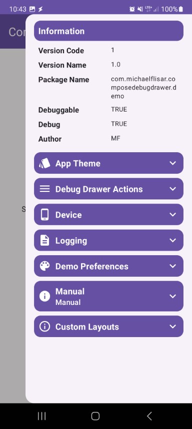
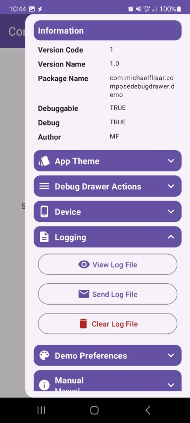

### About

This library offers you a **simple** and easily readme **debug drawer**.

## :camera: Screenshots

| Demos | | | |
|-|-|-|-|
|  |  |  |  |
|  |  |  |  |
|  |  |  | |

## :book: Documentation

The readme for this library with **code samples**, **screenshots** and more can be found on following *github page*:

Additionally there is also a full working [demo app](demo) inside the *demo module*.