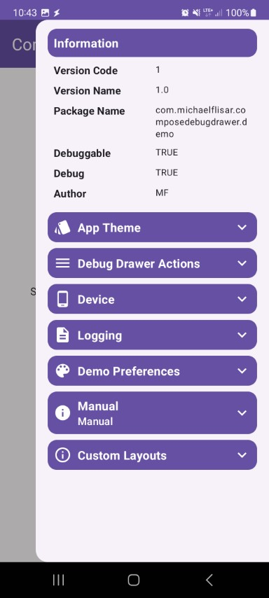

The `infos-build` module allows you to add a build info region to the debug drawer.

```kotlin
DebugDrawerBuildInfos(drawerState)
```

| Info Module                                                                                                        |
|--------------------------------------------------------------------------------------------------------------------|
|  |
