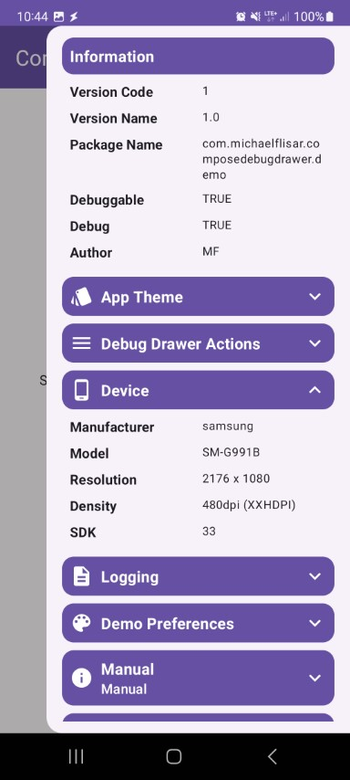

The `infos-device` module allows you to add a build info region to the debug drawer.

```kotlin
DebugDrawerBuildInfos(drawerState)
```

| Device Module                                                                                                |
|--------------------------------------------------------------------------------------------------------------|
|  |
